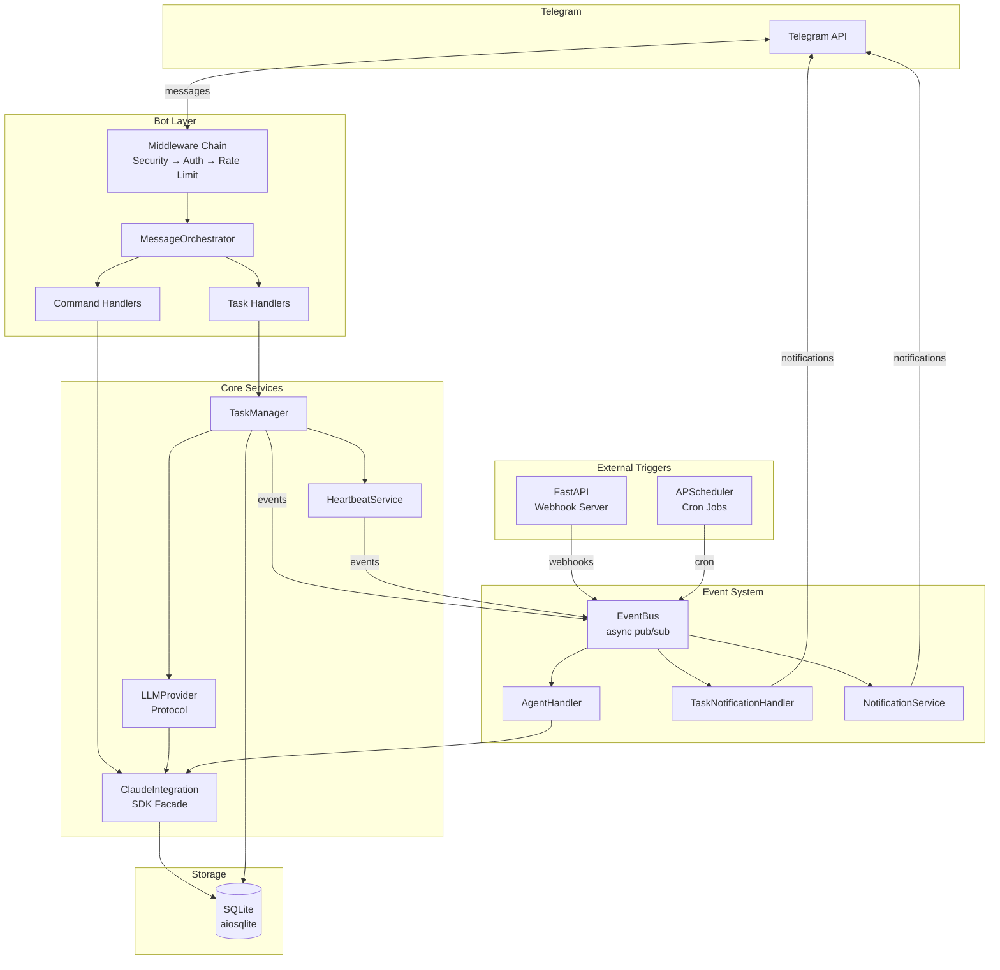

# CLAUDE.md

This file provides guidance to Claude Code (claude.ai/code) when working with code in this repository.

## Project Overview

Telegram bot providing remote access to Claude Code. Python 3.11+, built with Poetry, using `python-telegram-bot` for Telegram and `claude-agent-sdk` for Claude Code integration. Supports two modes: agentic (default, conversational) and classic (13-command terminal-like interface). Includes background task execution, webhook API server, job scheduler, and multi-project topic routing.

## Commands

```bash
make dev              # Install all deps (including dev)
make install          # Production deps only
make run              # Run the bot
make run-debug        # Run with debug logging
make test             # Run tests with coverage
make lint             # Black + isort + flake8 + mypy
make format           # Auto-format with black + isort

# Run a single test
poetry run pytest tests/unit/test_config.py -k test_name -v

# Type checking only
poetry run mypy src
```

## Architecture

### High-Level Architecture



### Claude SDK Integration

`ClaudeIntegration` (facade in `src/claude/facade.py`) wraps `ClaudeSDKManager` (`src/claude/sdk_integration.py`), which uses `claude-agent-sdk` with `ClaudeSDKClient` for async streaming. Session IDs come from Claude's `ResultMessage`, not generated locally.

Sessions auto-resume: per user+directory, persisted in SQLite.

### Request Flow

**Agentic mode** (default, `AGENTIC_MODE=true`):

```
Telegram message -> Security middleware (group -3) -> Auth middleware (group -2)
-> Rate limit (group -1) -> MessageOrchestrator.agentic_text() (group 10)
-> ClaudeIntegration.run_command() -> SDK
-> Response parsed -> Stored in SQLite -> Sent back to Telegram
```

**Background tasks** (`ENABLE_BACKGROUND_TASKS=true`):

```
/task <prompt> -> task_command() -> TaskManager.start_task()
-> asyncio.Task: LLMProvider.execute() -> ClaudeIntegration
-> HeartbeatService emits TaskProgressEvent every 60s
-> On completion: TaskCompletedEvent -> TaskNotificationHandler -> Telegram
```

**External triggers** (webhooks, scheduler):

```
Webhook POST /webhooks/{provider} -> Signature verification -> Deduplication
-> Publish WebhookEvent to EventBus -> AgentHandler.handle_webhook()
-> ClaudeIntegration.run_command() -> Publish AgentResponseEvent
-> NotificationService -> Rate-limited Telegram delivery
```

**Classic mode** (`AGENTIC_MODE=false`): Same middleware chain, but routes through full command/message handlers in `src/bot/handlers/` with 13 commands and inline keyboards.

### Dependency Injection

Bot handlers access dependencies via `context.bot_data`:
```python
context.bot_data["auth_manager"]
context.bot_data["claude_integration"]
context.bot_data["storage"]
context.bot_data["security_validator"]
context.bot_data["task_manager"]       # if background_tasks_enabled
```

### Key Directories

- `src/config/` -- Pydantic Settings v2 config with env detection, feature flags (`features.py`), YAML project loader (`loader.py`)
- `src/bot/handlers/` -- Telegram command, message, callback, and task handlers
- `src/bot/middleware/` -- Auth, rate limit, security input validation
- `src/bot/features/` -- Git integration, file handling, quick actions, session export
- `src/bot/orchestrator.py` -- MessageOrchestrator: routes to agentic or classic handlers, project-topic routing, background task guard, callback handlers (taskstop/tasklog/taskretry)
- `src/claude/` -- Claude integration facade, SDK/CLI managers, session management, tool monitoring
- `src/llm/` -- LLM provider abstraction: `LLMProvider` protocol, `ClaudeProvider` adapter, `create_llm_provider()` factory
- `src/tasks/` -- Background task system: `TaskManager` (lifecycle), `TaskRepository` (CRUD), `HeartbeatService` (monitoring), `BackgroundTask` model
- `src/projects/` -- Multi-project support: `registry.py` (YAML project config), `thread_manager.py` (Telegram topic sync/routing)
- `src/storage/` -- SQLite via aiosqlite, repository pattern (users, sessions, messages, tool_usage, audit_log, cost_tracking, project_threads, background_tasks)
- `src/security/` -- Multi-provider auth (whitelist + token), input validators (with optional `disable_security_patterns`), rate limiter, audit logging
- `src/events/` -- EventBus (async pub/sub), event types (10 types incl. Task* events), AgentHandler, EventSecurityMiddleware
- `src/api/` -- FastAPI webhook server, GitHub HMAC-SHA256 + Bearer token auth
- `src/scheduler/` -- APScheduler cron jobs, persistent storage in SQLite
- `src/notifications/` -- NotificationService (rate-limited delivery), TaskNotificationHandler (task lifecycle events)

### LLM Provider Abstraction

`LLMProvider` protocol (`src/llm/interface.py`) defines a provider-agnostic interface with `execute()` and `healthcheck()` methods. `ClaudeProvider` (`src/llm/claude_provider.py`) adapts `ClaudeIntegration` to this protocol. Factory function `create_llm_provider()` selects provider based on `LLM_PROVIDER` setting (currently `claude_sdk`, future: `gateway`).

`LLMResponse` dataclass unifies responses: `content`, `session_id`, `cost`, `duration_ms`, `num_turns`, `is_error`.

### Background Task System

`TaskManager` (`src/tasks/manager.py`) manages background task lifecycle:
- Enforces per-project exclusivity and global concurrency limit (`MAX_CONCURRENT_TASKS`)
- Launches tasks as `asyncio.Task` coroutines via `LLMProvider.execute()`
- Tracks cost accumulation, enforces `TASK_MAX_COST` limit
- Coordinates `HeartbeatService` for periodic progress notifications
- Publishes lifecycle events: `TaskStartedEvent`, `TaskCompletedEvent`, `TaskFailedEvent`
- Retries on transient failures (up to 2 retries with exponential backoff)
- `recover()` marks orphaned running tasks as failed on restart

`HeartbeatService` (`src/tasks/heartbeat.py`) runs per-task monitoring loops:
- Emits `TaskProgressEvent` every `HEARTBEAT_INTERVAL_SECONDS` (default 60s)
- Detects idle tasks and emits `TaskTimeoutEvent` after `TASK_TIMEOUT_SECONDS`
- Stage detection from Claude output (analyzing, writing code, running tests, committing)

`TaskNotificationHandler` (`src/notifications/task_notifications.py`) subscribes to task events and sends formatted Telegram messages with inline keyboards (retry, stop, view log buttons).

### Security Model

5-layer defense: authentication (whitelist/token) -> directory isolation (APPROVED_DIRECTORY + path traversal prevention) -> input validation (blocks `..`, `;`, `&&`, `$()`, etc.) -> rate limiting (token bucket) -> audit logging.

`SecurityValidator` blocks access to secrets (`.env`, `.ssh`, `id_rsa`, `.pem`) and dangerous shell patterns. Can be relaxed with `DISABLE_SECURITY_PATTERNS=true` (trusted environments only).

`ToolMonitor` validates Claude's tool calls against allowlist/disallowlist, file path boundaries, and dangerous bash patterns. Tool name validation can be bypassed with `DISABLE_TOOL_VALIDATION=true`.

Webhook authentication: GitHub HMAC-SHA256 signature verification, generic Bearer token for other providers, atomic deduplication via `webhook_events` table.

### Configuration

Settings loaded from environment variables via Pydantic Settings. Required: `TELEGRAM_BOT_TOKEN`, `TELEGRAM_BOT_USERNAME`, `APPROVED_DIRECTORY`. Key optional: `ALLOWED_USERS` (comma-separated Telegram IDs), `ANTHROPIC_API_KEY`, `ENABLE_MCP`, `MCP_CONFIG_PATH`.

Agentic platform settings: `AGENTIC_MODE` (default true), `ENABLE_API_SERVER`, `API_SERVER_PORT` (default 8080), `GITHUB_WEBHOOK_SECRET`, `WEBHOOK_API_SECRET`, `ENABLE_SCHEDULER`, `NOTIFICATION_CHAT_IDS`.

Background task settings: `ENABLE_BACKGROUND_TASKS` (default true), `HEARTBEAT_INTERVAL_SECONDS` (60), `TASK_TIMEOUT_SECONDS` (300), `TASK_MAX_DURATION_SECONDS` (3600), `TASK_MAX_COST` (10.0 USD), `MAX_CONCURRENT_TASKS` (3), `LLM_PROVIDER` (`claude_sdk`).

Security relaxation (trusted environments only): `DISABLE_SECURITY_PATTERNS` (default false), `DISABLE_TOOL_VALIDATION` (default false).

Multi-project topics: `ENABLE_PROJECT_THREADS` (default false), `PROJECT_THREADS_MODE` (`private`|`group`), `PROJECT_THREADS_CHAT_ID` (required for group mode), `PROJECTS_CONFIG_PATH` (path to YAML project registry), `PROJECT_THREADS_SYNC_ACTION_INTERVAL_SECONDS` (default `1.1`, set `0` to disable pacing). See `config/projects.example.yaml`.

Output verbosity: `VERBOSE_LEVEL` (default 1, range 0-2). Controls how much of Claude's background activity is shown to the user in real-time. 0 = quiet (only final response, typing indicator still active), 1 = normal (tool names + reasoning snippets shown during execution), 2 = detailed (tool names with input summaries + longer reasoning text). Users can override per-session via `/verbose 0|1|2`. A persistent typing indicator is refreshed every ~2 seconds at all levels.

Feature flags in `src/config/features.py` control: MCP, git integration, file uploads, quick actions, session export, image uploads, conversation mode, agentic mode, API server, scheduler, background tasks.

### Database Migrations

| Version | Name | Description |
|---------|------|-------------|
| 1 | Initial Schema | users, sessions, messages, tool_usage, audit_log, user_tokens, cost_tracking |
| 2 | Analytics Views | daily_stats and user_stats SQL VIEWs |
| 3 | Agentic Platform | scheduled_jobs, webhook_events, WAL mode |
| 4 | Project Threads | project_threads table for forum topic routing |
| 5 | Background Tasks | background_tasks table with status/cost/output tracking |

### Event Types

| Event | Source | Description |
|-------|--------|-------------|
| `UserMessageEvent` | telegram | User message from Telegram |
| `WebhookEvent` | webhook | External webhook (GitHub, etc.) |
| `ScheduledEvent` | scheduler | Cron/scheduled trigger |
| `AgentResponseEvent` | agent | Agent response for Telegram delivery |
| `TaskStartedEvent` | task_manager | Background task launched |
| `TaskProgressEvent` | task_manager | Periodic heartbeat (elapsed, cost, stage) |
| `TaskCompletedEvent` | task_manager | Task finished (duration, cost, commits) |
| `TaskFailedEvent` | task_manager | Task error (error message, last output) |
| `TaskTimeoutEvent` | task_manager | Task idle timeout (idle seconds) |

### DateTime Convention

All datetimes use timezone-aware UTC: `datetime.now(UTC)` (not `datetime.utcnow()`). SQLite adapters auto-convert TIMESTAMP/DATETIME columns to `datetime` objects via `detect_types=PARSE_DECLTYPES`. Model `from_row()` methods must guard `fromisoformat()` calls with `isinstance(val, str)` checks.

## Code Style

- Black (88 char line length), isort (black profile), flake8, mypy strict, autoflake for unused imports
- pytest-asyncio with `asyncio_mode = "auto"`
- structlog for all logging (JSON in prod, console in dev)
- Type hints required on all functions (`disallow_untyped_defs = true`)
- Use `datetime.now(UTC)` not `datetime.utcnow()` (deprecated)
- HTML output to Telegram: always use `escape_html()` from `src/bot/utils/html_format.py`

## Adding a New Bot Command

### Agentic mode

Agentic mode commands: `/start`, `/new`, `/status`, `/verbose`, `/repo`. If `ENABLE_PROJECT_THREADS=true`: `/sync_threads`. If `ENABLE_BACKGROUND_TASKS=true`: `/task`, `/taskstatus`, `/tasklog`, `/taskstop`, `/taskcontinue`. To add a new command:

1. Add handler function in `src/bot/orchestrator.py` (or `src/bot/handlers/` for modular handlers)
2. Register in `MessageOrchestrator._register_agentic_handlers()`
3. Add to `MessageOrchestrator.get_bot_commands()` for Telegram's command menu
4. Add audit logging for the command

### Classic mode

1. Add handler function in `src/bot/handlers/command.py`
2. Register in `MessageOrchestrator._register_classic_handlers()`
3. Add to `MessageOrchestrator.get_bot_commands()` for Telegram's command menu
4. Add audit logging for the command

## Adding a New Background Task Feature

1. If new event type needed: add dataclass to `src/events/types.py`
2. If new settings needed: add to `src/config/settings.py`, expose via `src/config/features.py`
3. Implement handler in `src/bot/handlers/task_handlers.py`
4. Register in `MessageOrchestrator._register_agentic_handlers()` under `background_tasks_enabled` guard
5. Subscribe to events in `TaskNotificationHandler.register()` if notification needed
6. Wire dependencies in `src/main.py` `create_application()`

## Adding a New LLM Provider

1. Implement `LLMProvider` protocol in `src/llm/new_provider.py`
2. Add provider name to `create_llm_provider()` factory in `src/llm/factory.py`
3. Add any required settings to `src/config/settings.py` (e.g., `LLM_GATEWAY_URL`)
4. Set `LLM_PROVIDER=new_provider_name` in environment
